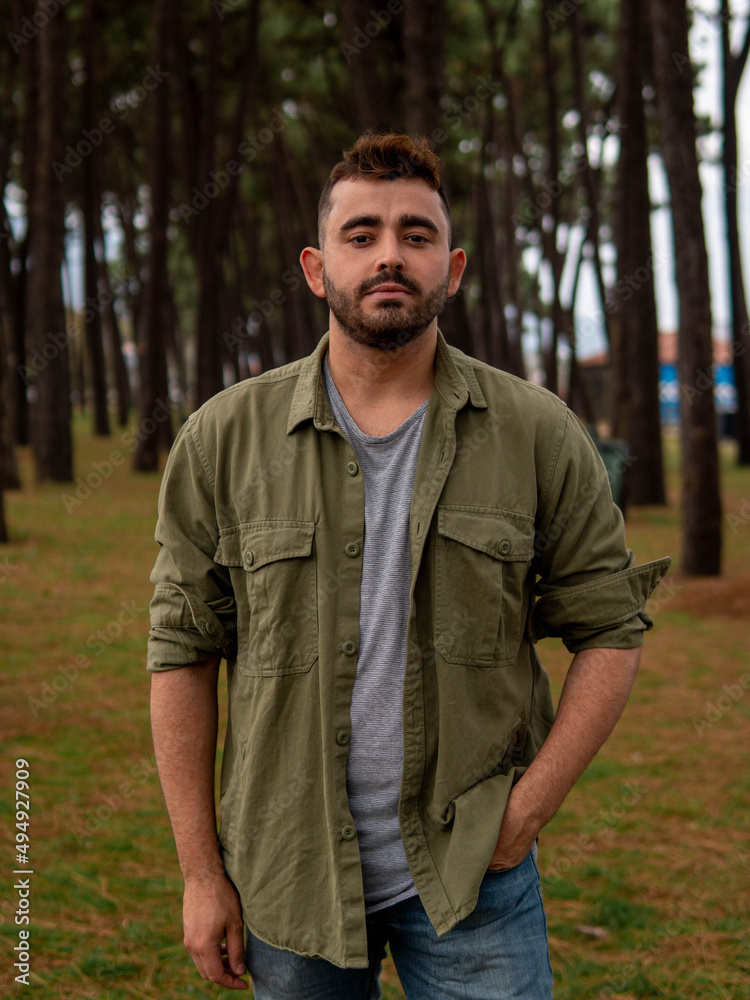

# Personas

John

A 25-year-old male in Portland Oregon
Works in fast food
High school dropout just drifting in life
John loves reading in his free time to escape his boring monotonous life. He works 9-5 in fast
food as a manager and comes home exhausted and wishing to be elsewhere. He is single and
lives in an apartment alone. He doesn’t have much social life but would like to connect with
others about what he reads.

He loves to read fantasy novels and imagine himself as the main character. Finishes books as
fast as he can as it’s his only hobby and way to enjoy himself. Has trouble finding more books to
binge as he goes through them too fast.

Goals:

- Escape his monotonous life

- Discover exciting fantasy novels

- Connect with people who love to read like him

---------------------------------------------------------

Logan

A 24-year-old male from Austin, Texas
BA in Science
Logan enjoys experimenting and learning new things in his field. He lives in a small house with
his pet dog. He likes to cook his own food and doesn’t go out to eat. When he comes home he
loves researching new science books that have come out and also likes to read science fiction
novels.

He has many friends in his field who all have diverse interests. He wants to get some of his
friends into reading sci-fi and new science books. He wonders where and how to do both.

Goals:

- Get his friends into reading science and sci-fi books

- Find more books to read

- Communicate with his friends about what he reads

---------------------------------------------------------

Raffaele

A 22-year-old male from Rome, Italy.
Raffaele is a Modern Languages student at the University of la Sapienza, in his hometown of
Rome. He still lives with his parents but dreams of traveling the world as soon as he gets a
decent job. He works during the summer as a lifeguard at the beach in Ostia, where his parents
have a summer home.

His main passion is cooking, he experiments with food all the time and he is really good at it, he
likes to have people over to try his brand-new recipes.

Goals:

- learn new recipes from all around the world

- find new cooking books

---------------------------------------------------------

Caroline

A 15-year-old female from Oceanside, California
Caroline is a high school student, she is really smart, probably she is going to graduate at the
top of her year and afterward she wants to major in Business.
The only thing is, she is not that well-liked by her peers. She has always been considered nerdy,
and in her school, she started to be bullied for it.

As a consequence, she spends all her free time in her room. Being by herself for so long, she
has developed a passion for horror books, she reads tons but this only makes her look weird in
the eyes of others, dangerous even.

Overall, she just wants to stop feeling so alone.

Goals:

- Meet people who share her interests and don’t make her feel weird about what she likes.

- Discover new horror books to read

- Share the books she knows with her new friends and talk about them

---------------------------------------------------------

Oliver

A 63-year-old male from London, England.
Oliver is a Medieval History teacher at the City, University of London. He loves his job and he
loves his students. He likes to involve people in his lessons, even if it is difficult with a large
class and when you teach something like history.

He feels sad when the students don’t participate in class or don’t answer his questions. He
knows that his class is difficult and some topics covered can be tedious but he is so passionate
about it that it hurts him when he sees students sleeping at their desks.
He has a wife and three grown children, and he is the proud grandfather of four toddlers, so he
is familiar with children and young adults.

Goals:

- Assign a new book for the students to read

- Find books and textbooks that talk about History in an engaging way

- Know what other college students say about those books

---------------------------------------------------------

# Scenarios

Scenario - John

John finally gets home from his 9-5 boring job and wants to sit down and enjoy his hobby of
reading. He looks around his apartment and see’s how empty and quiet it is and decides to start
reading. Unfortunately, he currently doesn’t have a new book to read as he’s already gone
through his current books and gets depressed. He wants to find more fantasy books to read
easily and fast.

---------------------------------------------------------

Scenario - Logan

Logan comes home and goes onto his computer and feels a bit lonely without his friends there
with him. His dog cheers him up but he still feels a bit down that his friends aren't into his hobby.
He tries to start reading some new science and science fiction books while thinking of his
friends and would love to share his hobby with them. After a short while, he finishes his current
stock of books and would love to find more books. Maybe some that his friends would enjoy.

---------------------------------------------------------

Scenario - Raffaele

It’s the week before Christmas and Raffaele have been put in charge of organizing the
Christmas lunch. He has been wishing for this day to come, his parents have never let him cook
for this day because they think his dishes are too extravagant, but this year they want to try
something new. The problem is, Raffaele has no idea what he should cook, he knows that his
guests are expecting something they have never had before, but he feels like nothing he can
offer is innovative enough.

---------------------------------------------------------

Scenario - Caroline

It’s almost 2 am and Caroline is reading a book under her covers, shining the flashlight of her
phone against the pages to be able to see. She always preferred to read at night, it made the
whole experience so much better. The thing is, she can’t concentrate. Today some boys at her
school had spray-painted the word “freak” on her locker, and as she was cleaning and crying,
she noticed that people were only laughing and no one was going to help her.

---------------------------------------------------------

Scenario - Oliver

Oliver is preparing for his next class at his desk at home. He is absentmindedly listening to his
wife sing while preparing dinner, she has always done that and he loves it. He has been thinking
about assigning a new book to read, but nothing that he has in his library seems good enough.
They are all long, old books that can be in no way appealing to a young college student, but he
has no idea where to find new titles.
