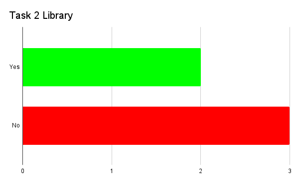
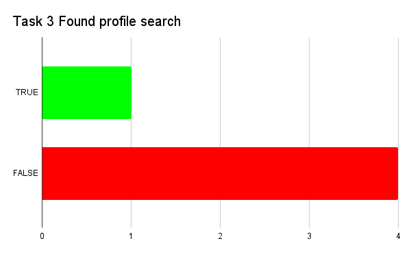
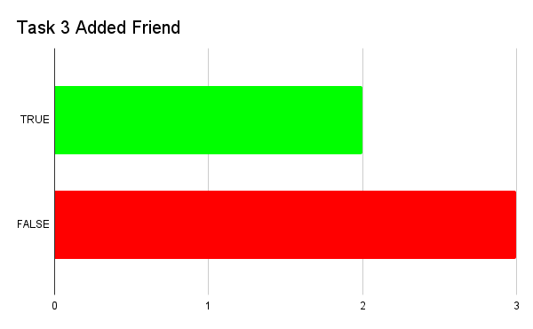
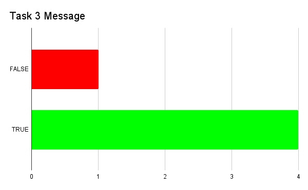
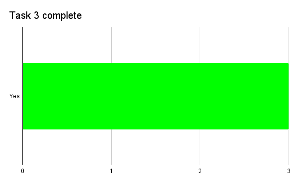
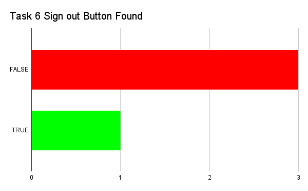
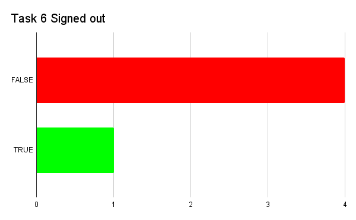

# Phase III: Prototypes and User Testing

## Introduction

During this phase, we worked on actually testing our prototype. We had five people perform a variety of tasks that allowed us to evaluate the features that we had implemented. Through this process, we were able to identify what was working and what needed to be improved regarding the interaction as well as the actual design of the prototype.

## Methods

We approached our user test with the goal of testing how easy the prototype is to navigate and operate. We wanted the participants to only use our prototype during the user test. We had the participants in the user test run through 6 tasks we thought were the most important to move forward in our project. In each task, we recorded their workflow to complete the task as milestones on each task we thought were important. We asked the participants to use the think-aloud protocol so that we can get more accurate data about their difficulties and concerns with the site. Before testing the participants, we asked them some background questions. 

* What is your age?
* Do you enjoy reading books?
  * (If so) How do you find new books?
  * Any difficulties:
 * Do you use social media?

The number of participants were (n=5). The list of tasks we asked the participants to do are as follows. 

* You have been wanting to read a new history book for some time now, but you don’t know exactly what yet. Once you find the history books, add the first one to your library.
  * Found a way to search for history books:    _Yes    _No
  * Add the book to the library:       _Yes     _No
  * Task completed:    _Yes      _No
  * Leave a review of the book in your library. 
  * Found the library:    _Yes    _No
  * Write the review:       _Yes     _No
  * Task completed:    _Yes      _No
  
* I want you to imagine you have an companion named @johnSmith that you want to communicate with. You need a way to communicate with them from the website. Find and communicate with them.
Found the profile search page:  __Yes       __No
  * Added them as a friend:             __Yes       __No
  * Sent them a message:               __Yes       __No
  * Task Completed                         __Yes       __No
  
* You really liked a post you have seen. In order to express this, comment on that post. 
  * Found the post:  		    _Yes       _No
  * Uploaded their comment:           _Yes       _No
  * Task Completed:        		    _Yes       _No

* Now that you are familiar with posts, try writing your own and posting it.
  * Write the post: 		    _Yes       _No
  * Uploaded the post                      _Yes       _No
  * Task Completed:                         _Yes       _No
* Now that you are done with your tasks, sign out of the website.
  * Found the sign out button:          _Yes       _No
  * Successfully signed out:              _Yes       _No
  * Task Completed:      		     _Yes        _No

After the tasks we asked the participants some wrap up questions to end off the user test. They are as follows. 
* Now that you have used the website, I want to know more about your impressions of it. Overall what did you like most about it?
* What did you dislike most about it?
* Overall, what were the difficulties you encountered during your experience using the site?
* Were the features easy to navigate?
* Are there any additional features you felt were missing or could be added?
* Do you have any insights on what could be done better?
* Any other thoughts or comments?
	
After the follow up questions, we thanked them for their time and ended the user test.

## Findings

During the completion of task 1, it was found that the majority of the participants were able to correctly perform the actions of searching for a book and adding it to their library. There was one thing that is important to bring to attention, at first most of the participants (about 60%) thought that the search bar would work like the one in google, meaning they expected to click on it and immediately be redirected to the search page. One participant even said, “this doesn’t do anything”. Still, after noticing that they were able to click on the search button right next to the textbox, they performed the task without issue. 

Task 2 seemed to be a bit more problematic for all of the participants. Most of the participants didn’t try to find the library at all since they were all already on the book page. Those who did (about 40%), though, did it only because it was implied in the task, but they expressed the fact that going to the library to review a book they had already opened up felt unnecessary. Also, both of these participants had difficulties finding the library. They both searched the top bar and expected the library to be behind the toolbox icon, where instead the notification page is. After some searching, they successfully found the library.

All five participants successfully completed the “leave a review” part of the task. One of the participants even vocalized how much they liked the book page and the rating system, which divides the ratings for general people from those from critics and people you follow. Another one even used the words “easy and straightforward” in relation to the leaving a review feature. 

Task 3 wasn’t completed how we expected by the majority of people and we assume it was because it wasn’t worded properly. Only about 40% of participants actually found the profile page and added the person we suggested as a friend. All of them though, besides 20%, were able to message them. This was possible since they found the inbox page on the top bar and simply texted the first person that was shown there. 

 

Task 4 was completed successfully by everyone. When asked for comments on that specific task some participants expressed that it was easy to complete since it was straightforward and similar to a lot of other social media that they are used to.

Task 5 was also easy to complete for everyone, still, there was one common thread between all of the participants. They assumed they would be able to write their own post on the homepage since that is where they found all of the other posts. After expressing this though, some had to search for a bit, while others went immediately to the profile page and were able to upload their own post successfully. One of the participants, however, said that they thought that “the word post wasn’t correctly defined”, which made it a bit more difficult for them to complete tasks 4 and 5.

Task 6 was by far the most challenging one, with only 20% of participants able to complete it. The sign-out button was on the “edit” page found on the profile page, but most of the participants didn’t think about opening it up, even if they had started to search through the whole prototype for a “sign-out” button. Most expected a drop-down menu to appear and the sign-out feature to be on that. 

When asked the question “what did you like the most about our website?” the answers varied a lot. Some liked how straightforward it was, how familiar and therefore easy to navigate. One of the participants used the words “my natural mapping worked really well”. Some others, as said before, liked the book page and the differentiation between general, friends, and critics' reviews and ratings. A few liked the filters on the search page and especially liked the “recommended” filter. Others also expressed appreciation for the fact that you can divide the search between books and accounts. Some also liked the social media aspect and expressed the need for a website like this. One of them didn’t enjoy reading books but wanted something like this for movies since he liked the platform so much.

Still, there were a lot of critiques made. First and foremost, all of the participants wished that the log-out button would be more visible and easier to find, and didn’t agree with the placement even after they were shown where it was. There were also people who expressed some visibility issues different from the log-out, for example, they thought that the edit button was too small and didn't indicate what it did properly.

Some people had issues with the top bar since some of the icons were not what they expected. For example, the toolbox was expected to be the library instead of the notification, or the profile icon was expected to have profile settings and not the actual profile page (even if only by one person). One of the participants went as far as saying that they had a “love/hate relationship with the top bar”.
Most people also didn’t like that they weren’t able to make posts on the homepage, since it was the place where they could find the other posts.

We also asked for recommendations on what could be done to improve the prototype and obviously, the answers were strictly related to the things they didn’t like. We had people suggest changing the icons on the top bar, others implemented the feature to upload posts directly on the homepage. Some said to create a dropdown menu that would appear when you click on the profile icon to make the sign-out process easier. On this dropdown menu, one said to include the library as they would have liked it to be separate from the profile page.
As far as some features to add, no one said anything specific. One of the participants said, “all of the features I expected were there”.

## Conclusions

From these findings, we were able to pinpoint the things that need to be improved or changed to make the website easier to navigate for our users. 
As far as formative conclusions go, we understood that we have to improve some things, like the icons on the top bar, we should add that dropdown menu that everyone expected when they clicked on the profile icons. We should also add the feature to make posts from the homepage. There is also the huge issue of the log-out button that needs to be moved to a more visible place, maybe the dropdown menu that was previously mentioned. These are all the things that our participants themselves recommended.
Our summative conclusions were a bit more positive, the prototype itself worked well enough that most tasks were completed. Besides some things that need to be moved or changed, everything worked as we expected and most tasks were gone through as we expected. There were exceptions but nothing that requires a lot of work on our part.
In the future, we should focus on perfecting the work we have already done by resolving the issues that our participants brought to our attention, as well as the formative revisions previously noted.

## Caveats

* Not wording questions correctly. For example, task 2 “leave a review of the book in your library”, implied the unnecessary step of going to the library to open the book page once more, even if task 1 ended on that same book page.

* Most tasks had leading words like “comment” or “post”, “log out” or “review” that corresponded with a feature on the prototype. 

* We tested people who were similar in age as well as occupation. Mainly students in a class. We didn’t have enough variety of users in the user test for more meaningful data. 

* We didn’t include an ease-of-use rating in the user test for each task. This limited our ability to collect information on how learnable and fun the prototype was. 

* On task 3 we asked the participants to search for someone named “@johnSmith” but then we didn’t have anyone named like that, so this caused confusion.

* We wanted people to be able to message a person only if they had that person as a friend but this wasn’t implemented correctly.

* Any changes suggested should be put through more user testing.

