# Wireframes

One of the tools at our disposal to design our product was the wireframe. By this, we mean a set of images representing the structure and functionality of a website, app, or product. 

In the following text, we aim to go over all of our wireframes in detail in order to explain how every page works and behaves, as well as all of the features that our final product will have. 

## Login and Sign up pages

We started with the pages that would allow the users to log in and sign up. These were utterly standard, similar to what you would find on any other website. It was done this way because this common action needs to be performed successfully to access the site, so it would not make sense to think of an innovative way to design this first interaction.

Insert images of the first two pages here

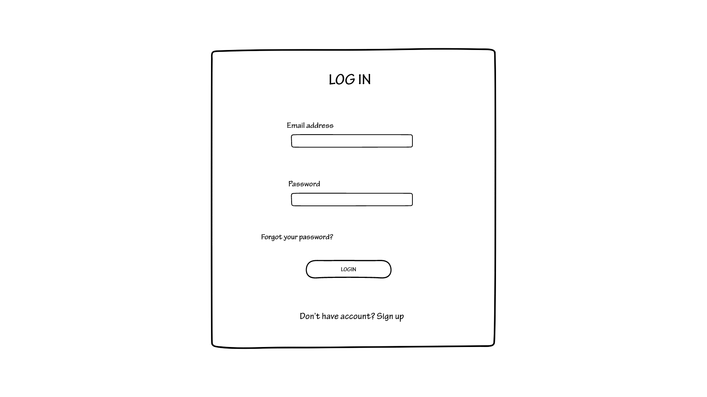

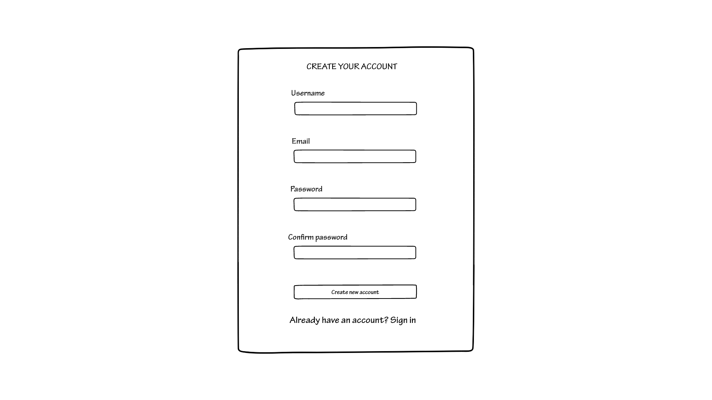

If the user does not have an account yet they should click on the bottom link in order to make one. Once they have filled in the text boxes, they should click on “create an account” in order to be brought back to the initial page where they are prompted to insert their login information. 
If the user already has an account they should provide their information and click on the LOGIN button to access the website.

The design of these two particular pages didn’t change much from our first idea, but we listened to the feedback we received. The feedback from the cognitive walkthrough conducted in class made us aware of the fact that the “Sign in” link was too small and they had trouble seeing it at first. Because of this, we decided to make all of the text on these pages bigger, so that nobody would have that kind of problem anymore. 

## forgot password 

On the login page you can see that there is a link that allows you to take action in case you forgot your password. 
By clicking this link you would be redirected to the following page

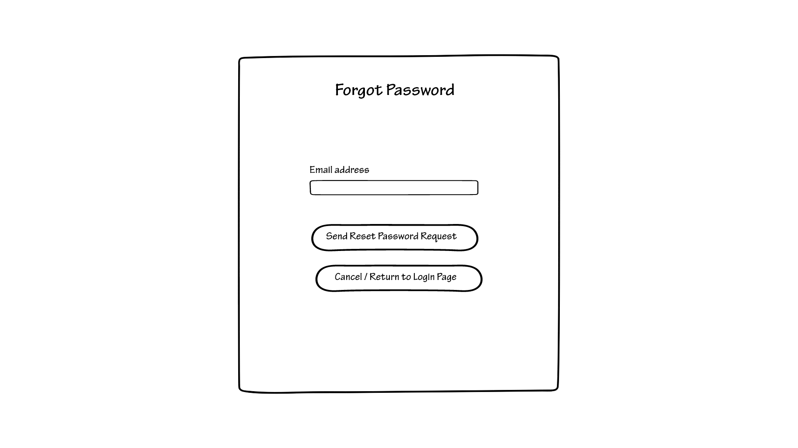

The page has a textbox in the center that prompts you to insert your email address in order to be able to reset your password. Once you type in your email address you can decide to either click on the button that would send you a reset code through said email, or go back to where you started from.

If you choose to receive a reset code, you will reach the following page.

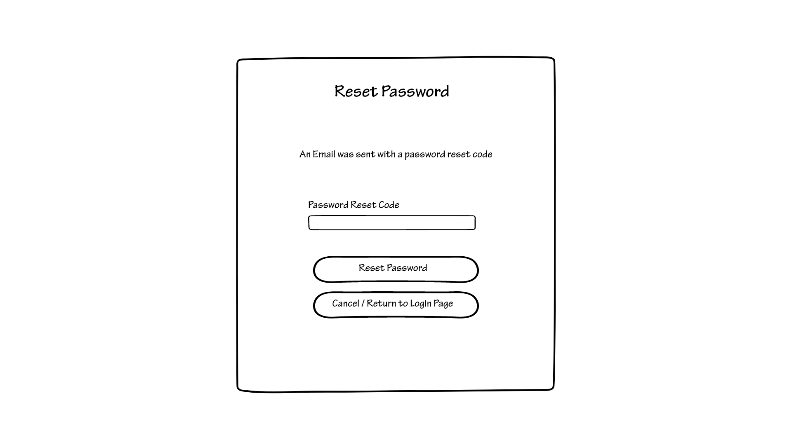

Once you input the code that was sent to you, you can finally reset your password by clicking on the button labeled “reset password”, that would bring you to the following page.

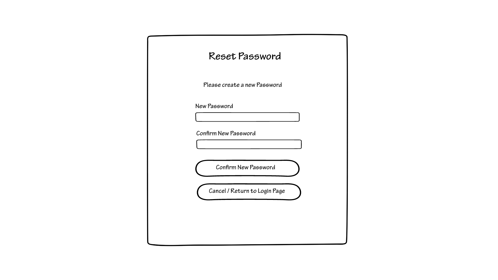

Once you type in the newly chosen password and click “confirm new password”, you have completed your task and now every time you log in you will have to use the new password that you just created.

At any point you can go back to the login page if you change your mind by clicking on the button “Cancel/Return to login page”.

## Home page

The first page that you would see once you access the website is the following.

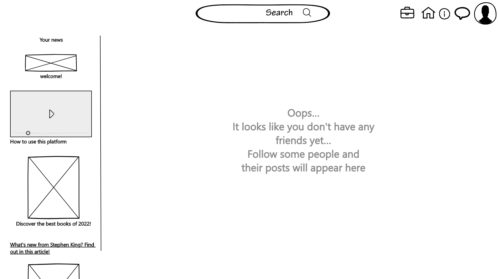

As you can see there are a lot of functionalities here, but we tried to make it as intuitive as possible.

The first version of the home page, shown before, is what you would see if you just signed up, when you still have to follow people. 

Still, we decided to make the main feature of the website as evident as possible. We were clear when we said that our product is first and foremost a social media platform, so we wanted to have a section that is similar to what you would have on twitter, where you can see what your friends posted. This is why the website itself prompts you to follow some people and interact with their posts through the homepage. 

On the left-hand side, we can see some videos and articles. At first, they would be very generic, but the more you interact with the website, the more they start to reflect your interests. For example, say that you really enjoy fantasy books, you have a lot stored in your virtual library and you leave good reviews, on the left side of the homepage, you will start seeing articles like “Upcoming fantasy books of 2023” or “The best fantasy books of all time” or interviews of your favorite authors. 

At first, though, you would have helpful videos and guides about how to interact with the platform. This is done because we want this website to be accessible to everyone, even people who have little to no experience with the Internet. 

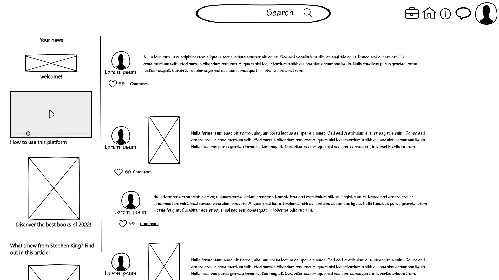

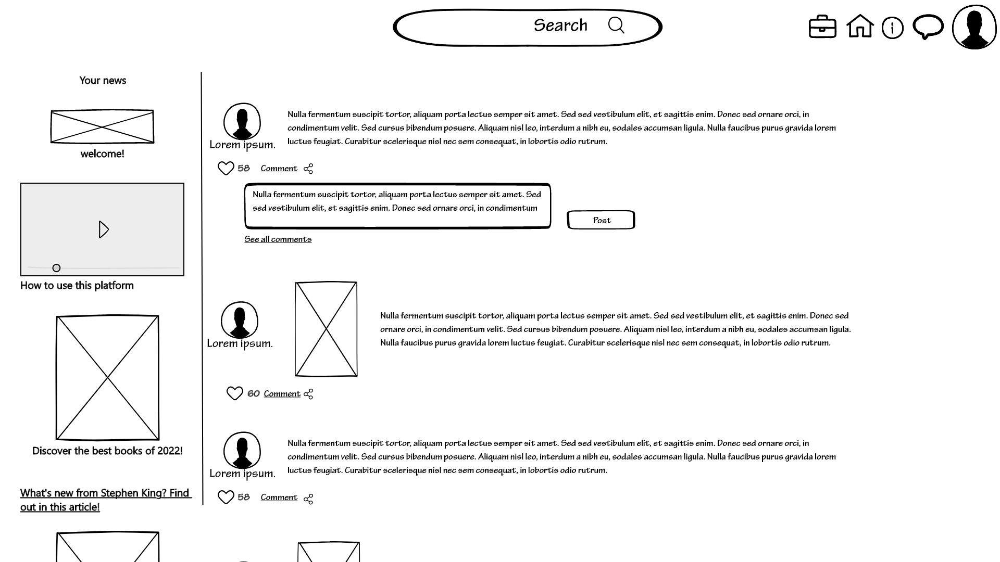

In this second version of the homepage, we show how the homepage would look once you start following people. You can then interact with the posts they make by leaving hearts or comments to express your opinion. You can also see what your interface would look like when you decide to leave a comment and post it. 

All of these versions have the top bar in common, where you can see, from left to right the logo, the search bar, the notifications and the homepage button (that would be inactive on this particular page), the info button, the chat, and the profile buttons. 

We received negative feedback on this top bar so we tried to improve it in our latest design. We decided to make the search bar bigger and with clear indications about where to type. This is because people seemed to have difficulty navigating around it.

## search page

Once you type something on the search bar and press the enter key on your computer’s keyboard you will be redirected to a search page:

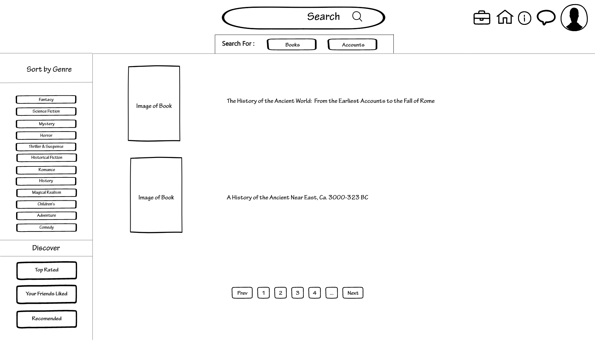

This page is what allows you to perfect your search. If you typed the title of a specific book it would show you that book, but if you decided that you wanted to search for something broader you would be able to navigate through a lot of different books through the buttons located on the left side of the screen.

These buttons would allow you to sort your results by genre by selecting one or more of the options present. Another function, located under the “Discover” label would help you find new books through three different personalized pages. The first one is simply going to show you the top-rated books present on the website. The second one will recommend books that were liked by your friends, while the third would show you the books recommended by an algorithm that can look at the books that you have liked and reviewed in the past. 
It is important to note that you can combine the two sets of buttons, for example, if you were to want to search for the top-rated fantasy books, you would click on the “top-rated” button and the “fantasy” category. 

At the top of the page, you are prompted to clarify what you are searching for, either books or accounts. If you selected “Books” you would see the page described before, while if you select “Accounts” you would see the following page

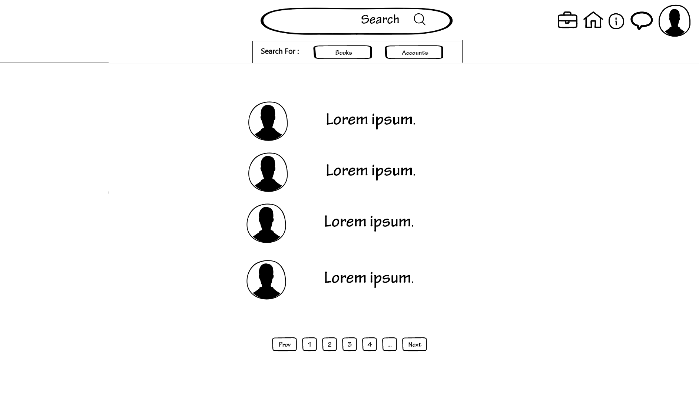

This is as straightforward as possible, it would simply show you the list of the profiles that have a username that is equal to or similar to the one you typed into the search bar. Obviously, if there is an identical match, that will be shown as a first result, and similar profiles would be shown later.

## book page

Now let us assume that you have found a book that interests you. To access the information about the said book you would have to click either on the cover or on the title to be redirected to another page.

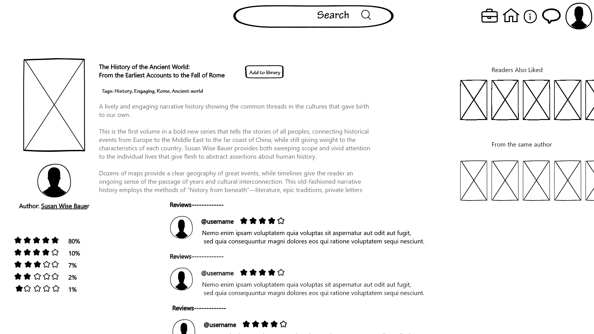

This page looks like what you would find on Goodreads or even on Amazon, so it is not particularly innovative. It simply shows you the cover of the book accompanied by the plot and the name of the author. By clicking on the name of the author you would be sent to that particular author’s profile page. Next to this, we can find the tags that best describe this book, so that if you particularly like a feature of that book you can just type the tag into the search bar and you would find books that are tagged in the same way. 

Other than this, on the right you would have a series of lists that feature that book, so you could discover other books that might have a similar plot or similar characteristics to the book you have already selected. This is done to encourage readers to explore other options and if they find a list they particularly like they might visit the profile page of the person who made it and meet a new friend. You will also find a list of books written by the same author. 

Of course, you would also need reviews. At the bottom of the page on the left, you will find the comprehensive evaluation of that book, seeing the percentages of stars they received from the users. For example, you could find a book that has 20% five stars, 30% four stars, 40% three stars, 7% two stars, and 3% one star. On the right-hand side, you will be able to read the detailed reviews and scroll down to load more. 

It is also important to note the button next to the title of the book. That button, labeled “add to library” allows you to add that book to your profile page. It will automatically show up on your “liked books” list, but you can customize it and move it to another list. 

## notification page

Now it’s time to analyze the pages you can access through the buttons at the top of the page. From left to right the first that you are going to see is the notification button, that for now looks like a suitcase but will probably be changed in the future. 

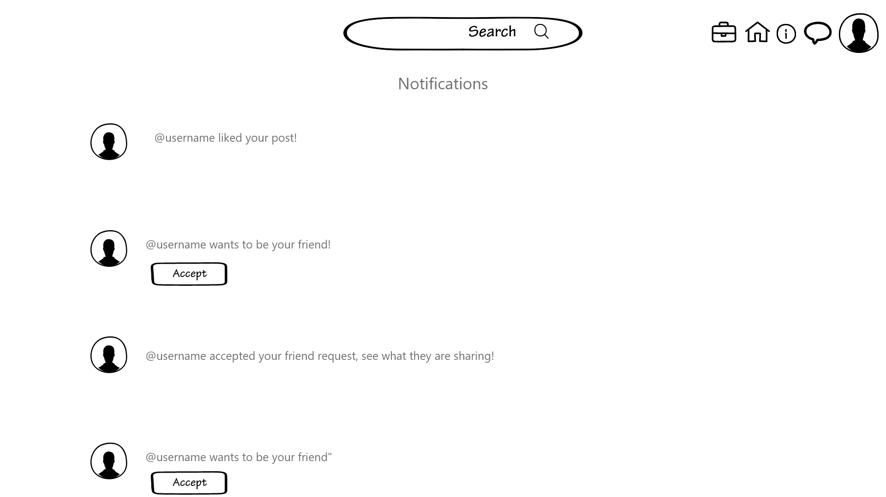

The notification page is essential since it will be the place where you will be able to accept friend requests. This is the main function of this page. Through here you will also be able to see who accepted your friend request as well as who likes your posts and comments under them.

## help page

The third button from the left on the top bar redirects you to a help page, designed to answer FAQs and solve some problems that you might be having.

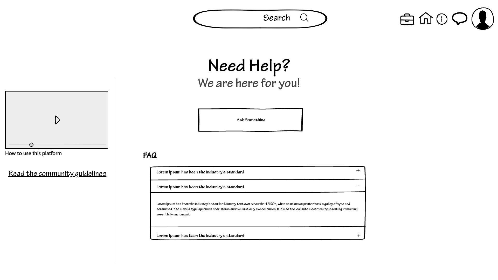

On the right side of the page, you can see that the “how to use this platform” video is repurposed because it will avoid errors that are made by the users only because they don’t understand how to interact with the platform effectively. 
Underneath this, you can read the community guidelines, which is a standard thing to have on the help/info page.

On the main part of the page, you can see a text box that allows you to type a question that will be answered with some delay by the people responsible for maintaining the page. 
Right underneath you will find a series of frequently asked questions in a drop-down style, meaning that if you click one of them the box will “open up” and show you the answer.
These frequently asked questions will be based on what we saw on other websites since we don’t have anyone, for now, to give us actual feedback on what could be asked. 

## Inbox page

This page is the core of this platform. This is what was missing in all of our competitors and this is the strength of our product. Even if the design is not innovative, we believe that this page is the most important of our platform. We want users to interact with each other and to have an efficient way to do it. 
This is also the reason why the design of the platform is not innovative, we want users to know how to interact with it without any help.

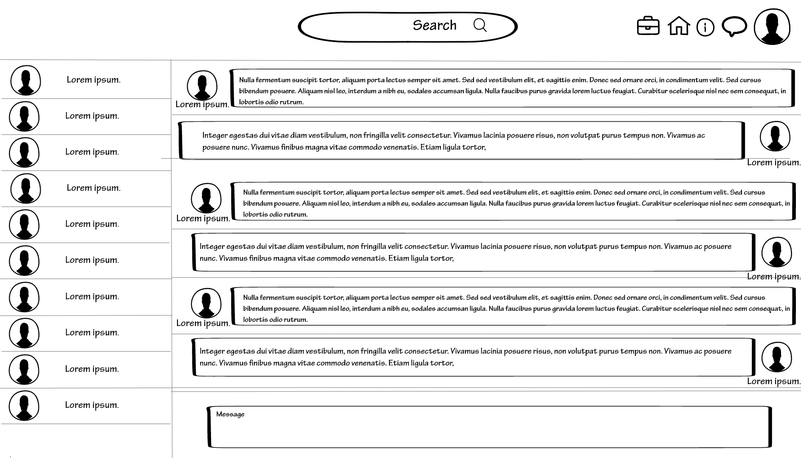

On the left of the screen, there is a list of the active conversations showing you the profile picture of the person you were talking to, as well as the username and the last message that was sent. This is what you would see in any messaging platform; think for example WhatsApp web or Instagram direct messages.

In the center of the street, you can see the last conversation that was taking place, which you can change by clicking on the conversations on the left. 

On the bottom of the page, there is a text box that allows you to type the message you want to send. You can send the message by clicking the “enter” key on your keyboard.

## profile page

The last page that we can access through the top bar is the personal profile page. This is your means to publish your posts and let people know something about yourself through your picture and your bio. On this page, people would be able to see your personal library as well as your previous post. 
It is also through this page that you can keep track of the books you have read and those that you want to read. You can also create new personalized lists to rearrange the books in the way you prefer. 

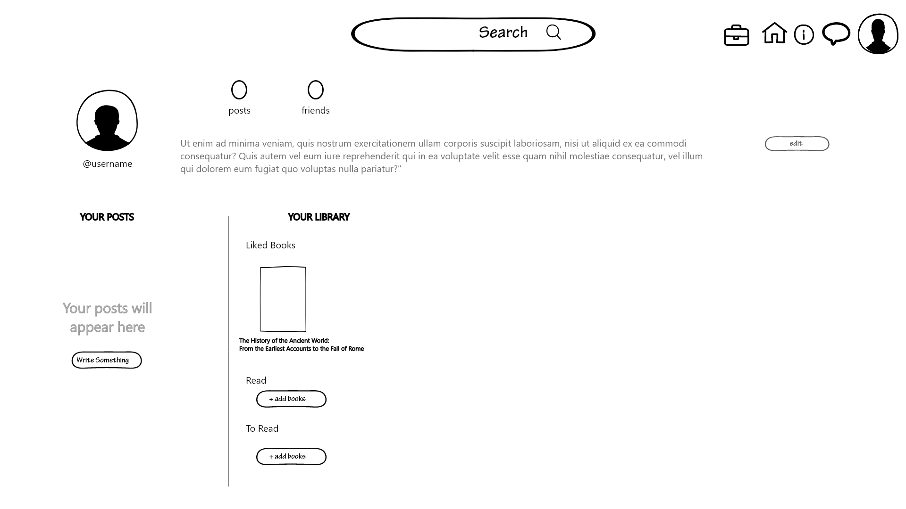

On the top of the page, you can see your profile picture as well as your username and bio, which you can update with the “edit” button placed on the right side of the screen next to the bio. You can also see the number of your posts and the number of people that you are friends with. 

Underneath that, you have on the left side the space where you can post something using the “write something” button. Once you press it your interface would look like this:

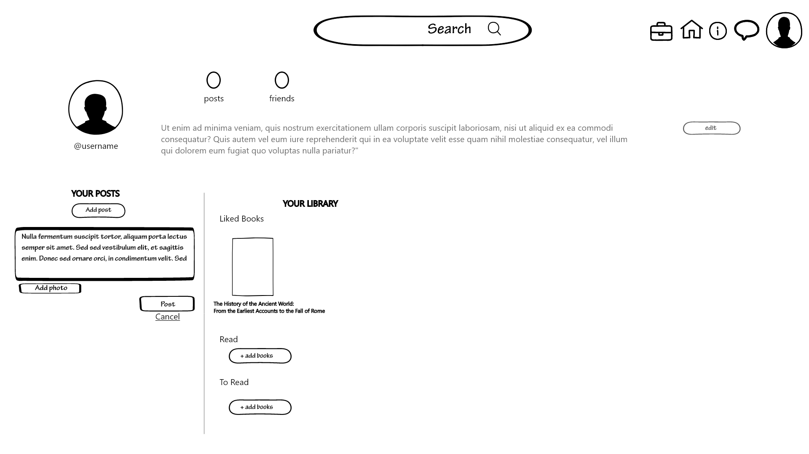

On the right side, you have your lists, where you can add books using the “+ add book” button, with an exception that will be explained later. There are three pre-made lists, “liked books”, “read”, and “to read”. You can create new lists using the “create new list” button. 
Regarding the previously mentioned exception, you can add books to almost any list with the “+ add book” button. To add books to the “liked books” list instead you have to go to the book page and click on the “add to library” button.

## edit profile 

As explained before, you can update your personal information using the “edit” button located on the profile page. Once you click it, you will be redirected to the following page

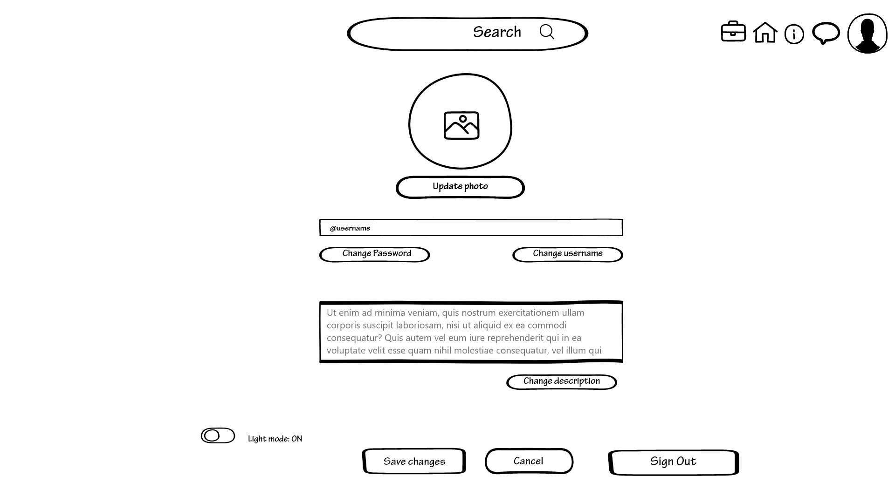

At the top of the page, you can see your profile picture, which would show what you have currently uploaded, but you can change it by clicking on the “update photo” button located right underneath it. You will be able to select your photo on your computer and upload it.

Right underneath you can see a textbox containing your username, which you can change as long as it was not already taken by another user on the platform. If your username does not satisfy this criterion, the change will not be accepted, and you will receive an error message.

There is also a button next to this that would allow you to change your password. This button would open a new page.

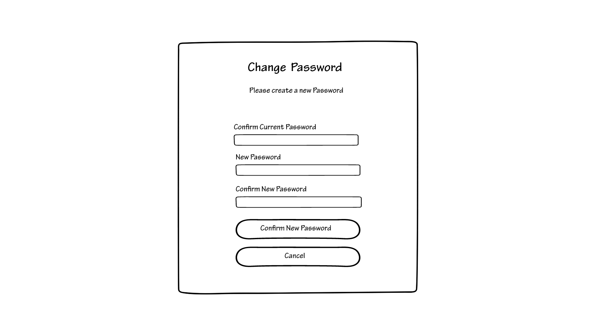

You would have to type in your current password in order to be able to change the password. Once you do, you type in the new desired password twice and click on the “Confirm new password” button that will save your changes and bring you back to the “edit profile” page. If you decide that you do not wish to proceed with the action you can just click on the “Cancel” button that will bring you back to the “edit profile” page without saving your changes.

Below this, you can update your bio in the same way, using the “change description”. 

Through this page, you can also change the settings to dark mode or light mode. You can do this using a slide button that next to it now shows the text “Light Mode: ON”, if you slide the button the text will be saying “Night Mode: ON”. This was done to avoid the confusion that usually comes with slide buttons. 

Once you are done with this and are satisfied with the changes, you can click the “save changes” button located at the bottom of the page, and you will be redirected to the main profile page, which will now be updated. If, on the other hand, you do not want to apply the changes, you can click the “cancel” button, and the profile page will look as it did before. 

Another important buttons on the page is the sign out button located at the bottom. Once you click the button a small window will display asking if you are sure you want to log out. 

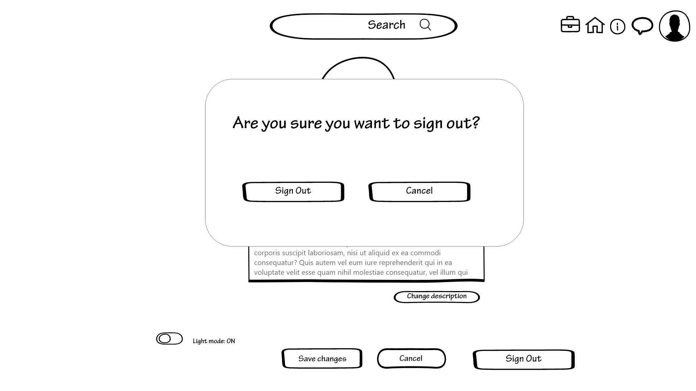  

If you cancel, it will just close itself and return you to the edit profile page. If you click sign out, you will be redirected to the log in page. 

## other profiles

Obviously you will need to interact with other people’s profiles. The interface will look almost identical to the one of your own profile, with the only difference that you will not be able to perform the same actions.

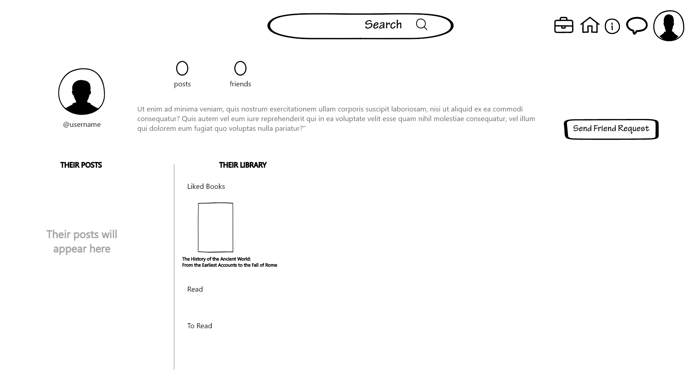  

You will not be able to make changes to their profile, but you can browse through their library, for example, you might want to see what books they liked or what lists they have made. 

You can also see their posts and interact with them in the same way you would have done on the homepage.

The most important thing, though, is that you can send them a friend request. You can do this through the button that is labeled as “send friend request”, as straightforward as possible. This button is located where the “edit” button is located in your profile.

## ending

This is the most accurate explanation of the wireframes that we could manage. We decided to describe in detail each page and how it works instead of performing a cognitive walkthrough because we deemed it better to be thorough with a detailed explanation rather than just going over a portion of all the functionalities. 

We also listened to the feedback we received and changed our first draft to solve the problems that came up during the cognitive walkthrough, to better meet the needs of our users in the future. 

